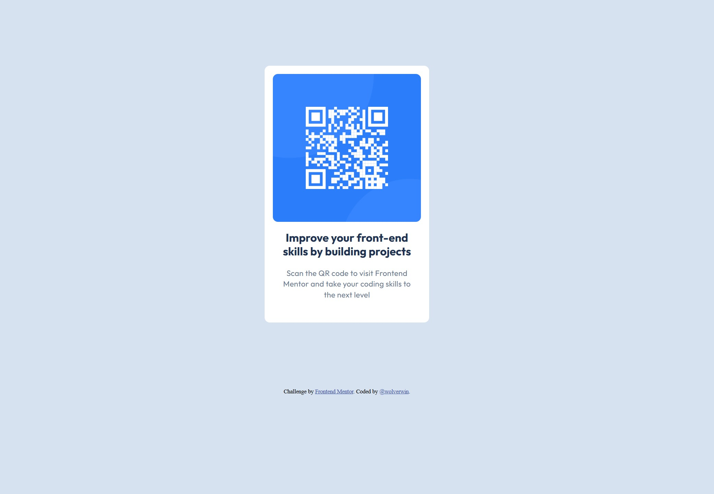

# Frontend Mentor - QR code component solution

This is a solution to the [QR code component challenge on Frontend Mentor](https://www.frontendmentor.io/challenges/qr-code-component-iux_sIO_H). Frontend Mentor challenges help you improve your coding skills by building realistic projects. 

## Table of contents

- [Overview](#overview)
  - [Screenshot](#screenshot)
  - [Links](#links)
- [My process](#my-process)
  - [Built with](#built-with)
  - [What I learned](#what-i-learned)
  - [Continued development](#continued-development)
  - [Useful resources](#useful-resources)
- [Author](#author)
- [Acknowledgments](#acknowledgments)

**Note: Delete this note and update the table of contents based on what sections you keep.**

## Overview

### Screenshot

### Links

- Solution URL: [My solution on GitHub](https://github.com/wolverwin/qr-code-component-main)
- Live Site URL: [Add live site URL here](https://your-live-site-url.com)

## My process

I started writing all needed HTML and adding all the content to the correct sections. Then I added needed classes to the HTML and started my SCSS file.

### Built with

- Semantic HTML5 markup (or at least I tried)
- Flexbox
- SASS

### What I learned

I learned how to correctly layout with CSS and how to use some SASS features.

### Continued development

In the next lessons, I want to focus more on how to create good layouts and SASS.

### Useful resources

- [CSS-tricks](https://css-tricks.com/a-complete-guide-to-css-media-queries/) - This helped me get a better understanding of media-queries.
- [mdn web docs - CSS Layout](https://developer.mozilla.org/en-US/docs/Learn_web_development/Core/CSS_layout) - Always a good resource to find out more about web dev topics

## Author

- Frontend Mentor Profile - [@wolverwin](https://www.frontendmentor.io/profile/wolverwin)

## Acknowledgments

Looking at the solution provided by [@NorimNori](https://www.frontendmentor.io/solutions/responsive-qr-code-component-with-flexbox-and-css-grid-w_du-Y3I3a) gave me a good starting point for my CSS layout.